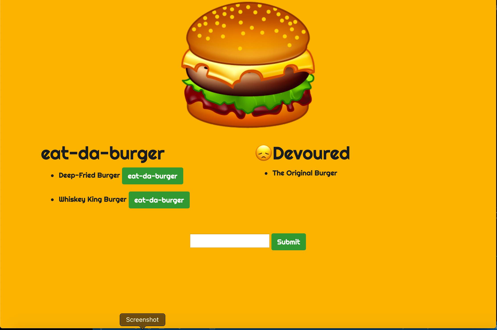

  # Burger App
  

  

## Description 
 
  create a burger logger with MySQL, Node, Express, and  Handlebars. Use MySQL to query, the server to route data in your app, and Handlebars to generate your HTML.

## Table of Contents 
 
- [Installation](#Installation) 

- [Usage](#Usage) 

- [License](#License) 

- [Contributing](#Contributing) 

- [Tests](#Tests) 

- [Questions](#Questions) 


## Installation  

```
npm install
```

## Usage 


## License 

This project is licensed under MIT license.

## Contributing 

nothing

## Tests 

```
npm test
```

## Questions 


If you have any questions, please contact adriana-didden directly at adriana.j.didden@gmail.com. 

